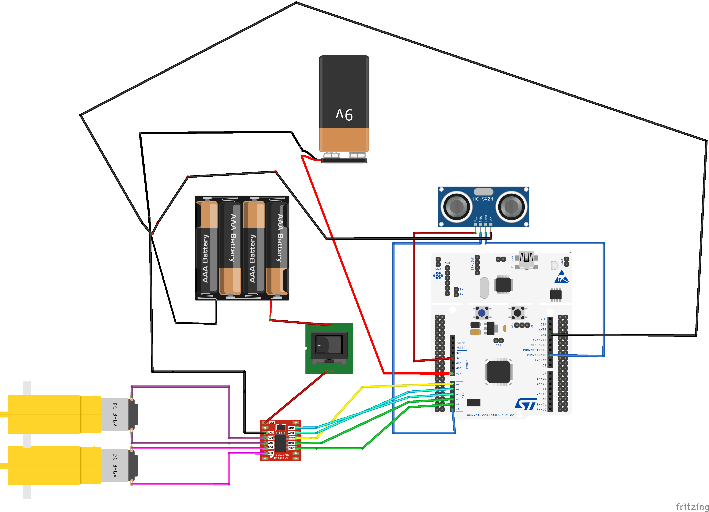

# STM32 Autonomous Obstacle Avoidance Car

An autonomous robot car built around the **STM32 Nucleo-F446RE** microcontroller. The car uses an ultrasonic sensor to detect objects in its path and automatically navigates around them using a custom dual-motor drive system.

## 🚀 Project Overview
This project demonstrates hardware interfacing, HAL-based timer configuration for microsecond-level precision, and custom state-machine logic in C.

The car continuously polls an HC-SR04 ultrasonic sensor using `TIM4`. Based on the returned distance, it dynamically adjusts its movement:
* **Clear Path (> 40cm):** Drives forward at full speed.
* **Caution Zone (25cm - 40cm):** Executes a custom `Roll()` function (a rapid forward/reverse pulse) to safely creep toward the object without requiring hardware PWM.
* **Obstacle Detected (< 25cm):** Halts, reverses, executes a hard right turn, and resumes forward navigation.

## 🛠️ Hardware Requirements
* **Microcontroller:** STM32 Nucleo-F446RE
* **Sensor:** HC-SR04 Ultrasonic Distance Sensor
* **Motor Driver:** TB6612FNG (Simplified module without PWM inputs)
* **Chassis:** Standard 2WD/4WD Robot Car Kit with DC Gear Motors
* **Power Supply:** 
  * 4xAAA (4.8V) Battery Pack (dedicated to driving the motors)
  * 9V Battery connected to VIN (dedicated to the Nucleo and sensor logic)

## 🔌 Pin Configuration
The GPIOs are configured via STM32CubeMX and mapped as follows:

| Component | Pin Label | STM32 Port/Pin | Function |
| :--- | :--- | :--- | :--- |
| **Driver STBY** | `A0` | `PA0` | Brings driver out of standby |
| **Right Motor (AIN1)** | `A1` | `PA1` | Right Motor Direction 1 |
| **Right Motor (AIN2)** | `A2` | `PA2` | Right Motor Direction 2 |
| **Left Motor (BIN1)** | `A3` | `PB0` | Left Motor Direction 1 |
| **Left Motor (BIN2)** | `A4` | `PC1` | Left Motor Direction 2 |
| **Sensor TRIG** | `A5` | `PC0` | Triggers 10µs ultrasonic pulse |
| **Sensor ECHO** | `D10` | `PB6` | Receives pulse (Read via `TIM4`) |

## ⚙️ Software & Setup
The project was generated using **STM32CubeMX** and developed in **STM32CubeIDE**. It utilizes the STM32 HAL (Hardware Abstraction Layer) libraries. 

To get started:
1. Clone the repository to your local machine.
   
2. Open the project in STM32CubeIDE.

3. If necessary, open the `.ioc` file to review the hardware configuration:
  * TIM4 is configured with an internal clock source, a prescaler of `83`, and a period of `65535` to provide exactly 1-microsecond tick resolution.
  * UART2 is enabled at `115200` baud to allow `printf()` to output real-time distance measurements to a serial console.

4. Build the project and flash it to the Nucleo-F446RE via the onboard ST-LINK.

## 💡 Electrical Diagram

## 📝 Key Code Highlights

* `Get_Distance()`: Calculates the distance to obstacles by manually starting/stopping `TIM4` to measure the width of the `ECHO` pulse in microseconds, including safety timeouts to prevent the microcontroller from freezing if sound waves fail to return.
* `_write()`: Retargets the standard C library so `printf()` outputs directly through the ST-LINK USB connection.

## 📸 Physical Build

  
  

